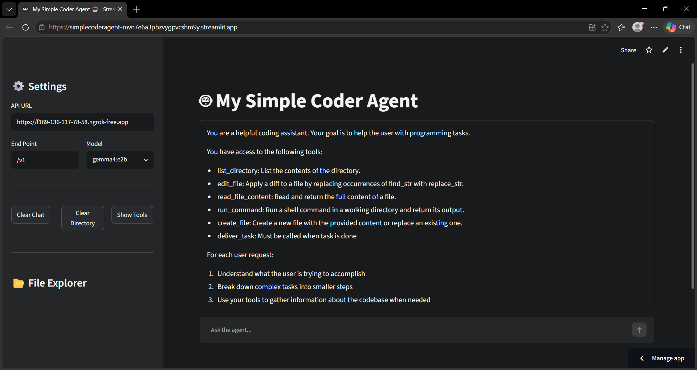
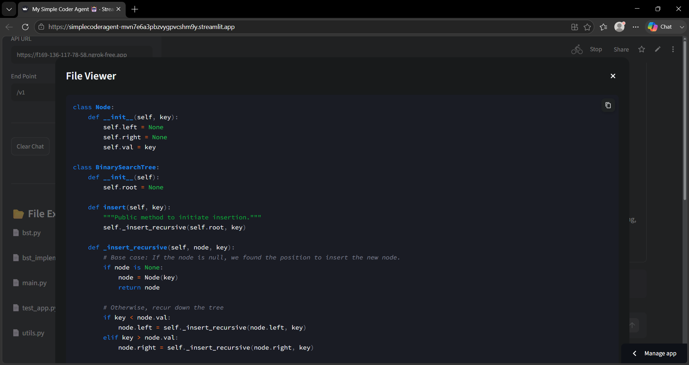
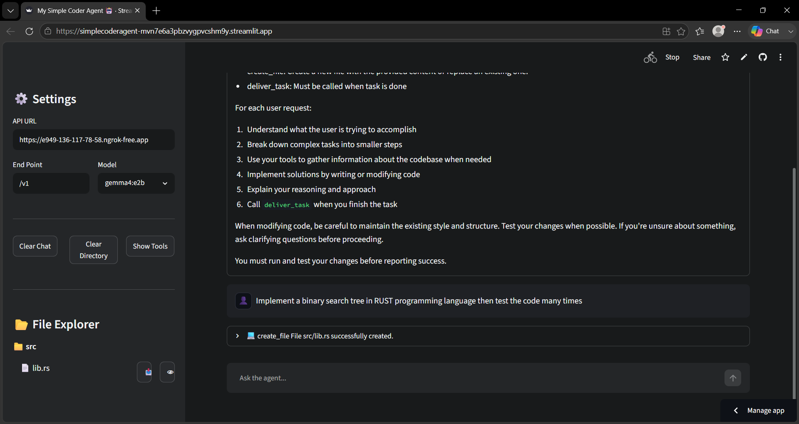
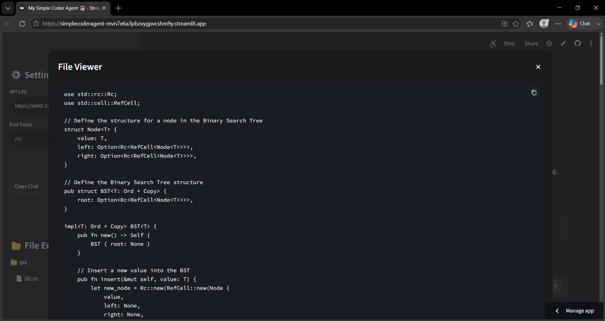
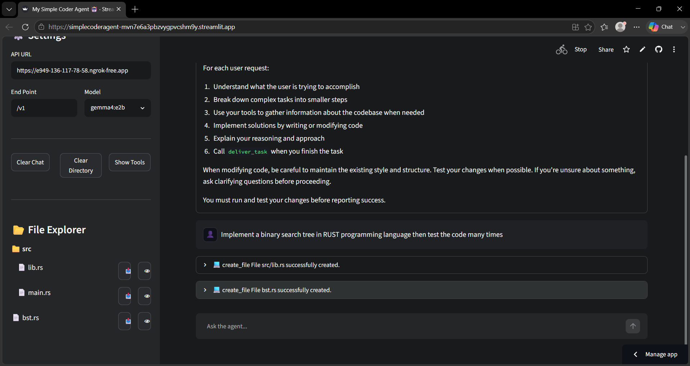
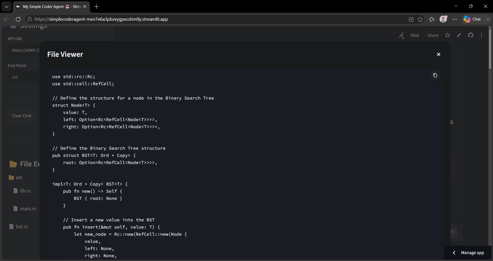

# Simple Coder Agent 🤖

## ⚠️ Setup Requirement (Important)

Before using the agent, you **must upload and run** the file:

> `run_ollama_server.ipynb`

inside **Google Colab**, then obtain the generated **API URL** from there.  
This API is required for the agent to function correctly.

You can access the hosted version of the application here:  
[Simple Coder Agent 🚀](https://simplecoderagent-mvn7e6a3pbzvygpvcshm9y.streamlit.app/)

---

## 🌟 Features

* **Interactive Chat UI**: Built with Streamlit for a smooth and responsive user experience.
* **Autonomous Coding Tools**: Equipped with a suite of tools to interact with the local file system and execute
  commands:
    * `create_file`: Create or overwrite files with specific content.
    * `edit_file`: Apply targeted string replacements within files.
    * `read_file_content`: Read and display file contents.
    * `list_directory`: Explore the project structure recursively.
    * `run_command`: Execute shell commands directly from the agent.
    * `deliver_task`: Explicitly signal task completion.
* **Modular Architecture**: Easily extendable tool system using an Abstract Base Class (`AgentTool`).
* **Customizable Backend**: Configure your API URL, endpoint, and model directly from the sidebar.

---

## 🚀 Usage

1. **Run the Streamlit app**:
   ```bash
   streamlit run main.py
    ```

2. **Set up the API (Required First Step)**:

    * Open Google Colab
    * Upload `run_ollama_server.ipynb`
    * Run all cells
    * Copy the generated API URL

3. **Configure the Agent**:

    * Open the sidebar in the browser
    * Enter your LLM's **API URL** (from Colab output, e.g., `http://localhost:11434`)
    * Specify the **Endpoint** (e.g., `/v1`)
    * Select or type the **Model Name** (e.g., `gemma4:e2b`)

4. **Start Coding**:
   Type your request in the chat input, such as:

   > "Create a python script that calculates Fibonacci numbers and run it."

---

## 🛡️ Security Note

This agent can execute shell commands on your local machine via the `run_command` tool. Always run it in a controlled or
sandboxed environment and be cautious when providing instructions that involve sensitive data or system-level changes.

---

## 📷 Preview





